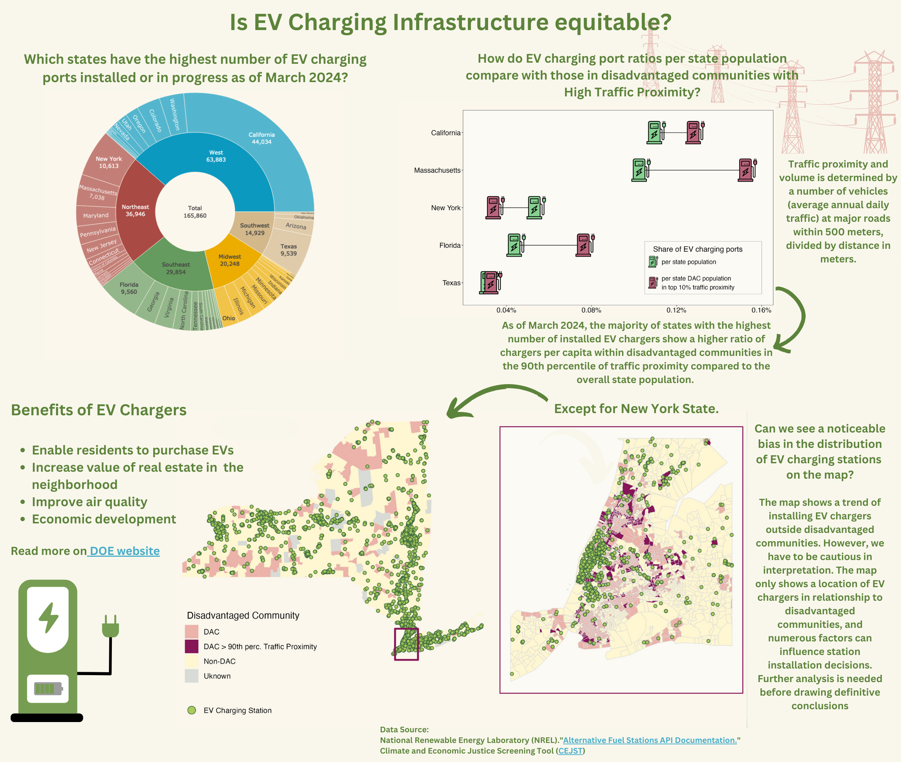

# Socio-economic equity in U.S. public EV charging network (data visualization)



### Table Of Contents

1. [Objective](#objective)
2. [Installation](#installation)
3. [File Structure](#file-structure)
4. [Data](#data)
5. [Usage](#usage)
6. [Contribute](#contribute)
7. [License](#license)

## Objective
The notebook provides a step-by-step guide to creating three separate charts for the final infographics illustrating the accessibility of charging infrastructure within disadvantaged communities in the United States.

## Installation

[Back to top](#table-of-contents) <br>

**Repository**: [evse_equity_data_viz](https://github.com/oksanaprotsukha/evse_equity_data_viz.git)

The analysis is written in R-language. The following tools are required to rerun the analysis: <br>
- R-ready environment (`RStudio`, `VSCode`) <br>
- R-libraries to create the charts: tidyverse (ggplot2), plotly and sf <br>
- API key to download EV charging network data from [NREL](https://developer.nrel.gov/docs/api-key/). The key is stored in `scr/config.R` <br>

**Note**: Data import and initial processing are handled in the file `src/prep.R` .<br>

## File Structure

[Back to top](#table-of-contents) <br>

```         
evse_equity_data_viz
├── LICENSE
├── README.md
├── analysis
│   ├── ev_se_data_viz.html
│   └── ev_se_data_viz.qmd
├── assets
│   ├── Infographic_Equitable_EV_Charging_Infrastructure.png
│   ├── choropleth_p.png
│   ├── data_viz_mockup.png
│   ├── dumbell_p_bg.png
│   ├── ev_dac_icon.png
│   ├── ev_state_icon.png
│   ├── fonts
│   └── sunburst_p.png
├── data
│   ├── output
│   ├── raw
│   │   ├── 1.0-codebook.csv
│   │   ├── readme-version-1.0.md
│   │   └── usa
│   └── temp
├── evse_equity_data_viz.Rproj
└── src
    ├── config.R
    ├── filepath.R
    └── prep.R
```

## Data

[Back to top](#table-of-contents) <br>

The analysis is based on two datasets.

#### Dataset 1: Climate and Economic Justice Screening Tool (shapefiles)

The dataset highlights disadvantaged census tracts across the United States, and the U.S. territories for the following categories: climate change, energy, health, housing, legacy pollution, transportation, water and wastewater, and workforce development.
For this infographic I used transportation categories, as well as the community's status as disadvantaged or not. <br>

The shapefiles can be downloaded from [here](https://screeningtool.geoplatform.gov/en/downloads#3/33.47/-97.5). <br>

#### Dataset 2: Alternative Fuels Data Center (NREL API)

The data set is accessible via NREL maintained API and provides a list of over 70 features related to alternative fuels alternative fuels stations. <br>
More details can be found [here](https://developer.nrel.gov/docs/transportation/alt-fuel-stations-v1/all) <br>

## Usage

[Back to top](#table-of-contents) This repo can be used to reproduce and contribute to the analysis.

## Contribute

[Back to top](#table-of-contents) Use issues to contribute to the project:

``` shell
https://github.com/oksanaprotsukha/evse_equity_data_viz/issues
```

## License

[Back to top](#table-of-contents)

[MIT license](./LICENSE)

### Acknowledgements
Samantha Csik, Professor for EDS-240 - Data Visualization & Communication</br>
Sevan Esaian, Teaching Assistant for EDS-240 - Data Visualization & Communication</br>
Bren School of Environmental Science & Management</br>
University of California, Santa Barbara
